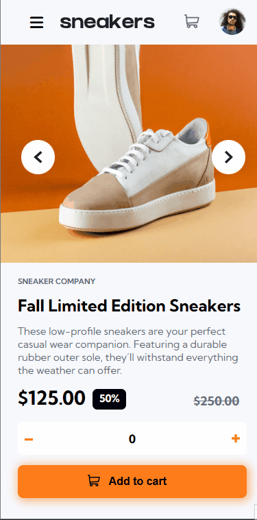

# Ecommerce Product Page Main

Olá a todos! Hoje venho apresentar um novo projeto: Ecommerce Product Page Main. Este projeto simula uma página de compra de um produto e foi desenvolvido como parte do desafio Frontend Mentor no nível intermediário.

## O que temos nesse Projeto

O projeto conta com uma imagem principal do produto, além de imagens em miniatura que, ao serem clicadas, exibem a versão em tamanho maior. Também inclui um carrossel para facilitar a navegação entre as diferentes imagens.

O carrinho é funcional: inicialmente, ao clicar, ele indica que está vazio. Quando o produto é adicionado, o carrinho passa a exibir um contador com a quantidade de itens e, ao clicar, mostra o valor por unidade e o valor total, calculado conforme a quantidade de produtos. Além disso, o carrinho possui um ícone de lixeira que, ao ser clicado, limpa todos os itens do carrinho.

O sistema também oferece botões de "+" e "-" para ajustar a quantidade de unidades desejadas, além de um botão de "Adicionar ao carrinho" para realizar a inclusão do produto.

O projeto é responsivo e se adapta a diferentes tamanhos de tela, oferecendo uma melhor experiência ao usuário. No entanto, enfrentei algumas dificuldades durante o desenvolvimento dessa funcionalidade e continuarei trabalhando para aprimorar essa habilidade.

## Experiência com o Projeto

Esse projeto me deu bastante trabalho mas obtive um aprendizado bem valioso com ele e aprimorei habilidades que já tinha.

## Tecnologias Utilizadas

- HTML
- CSS
- JavaScript
- Biblioteca de Animações CSS